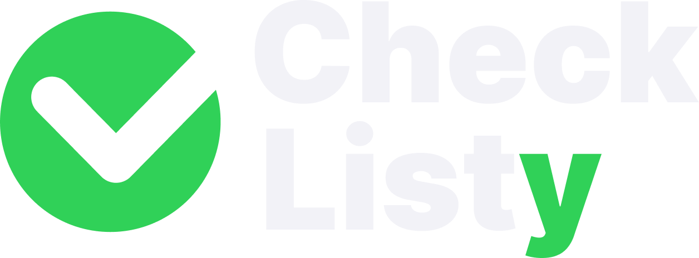
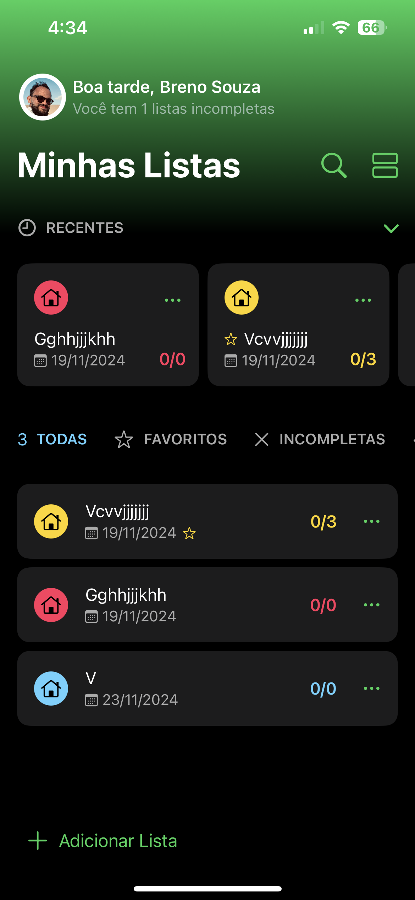
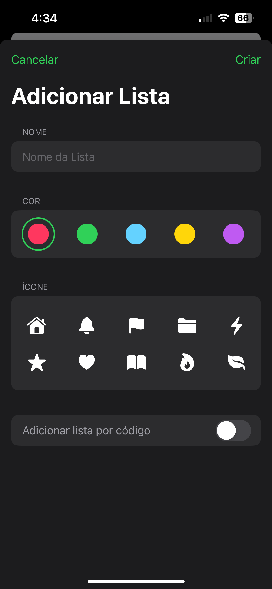
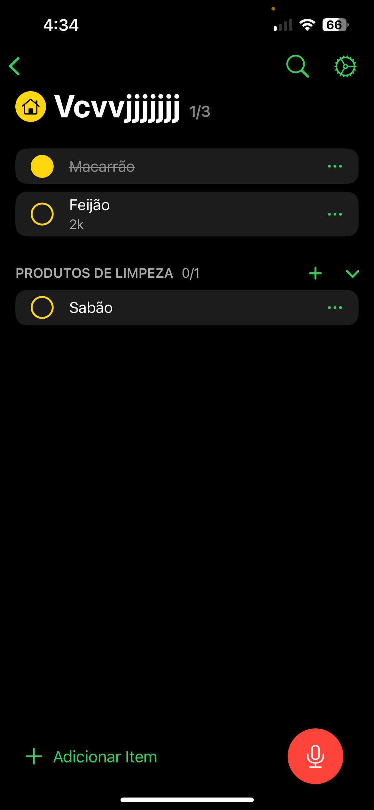
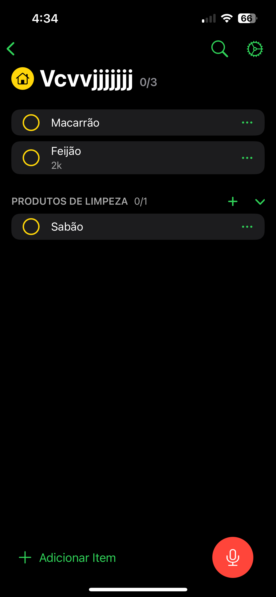
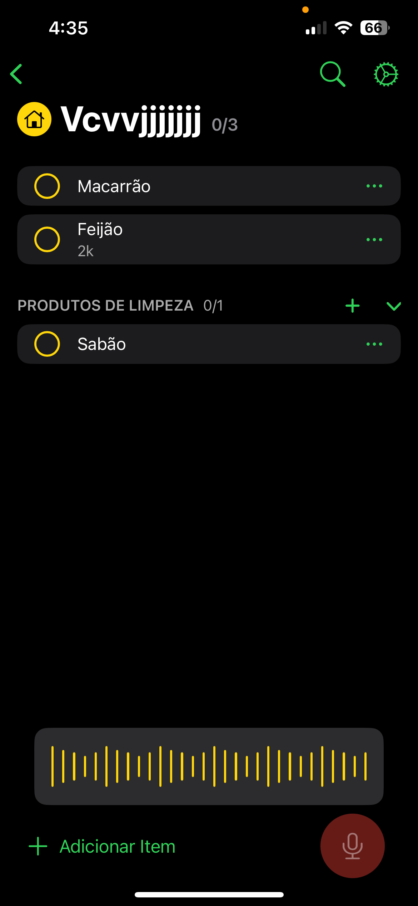
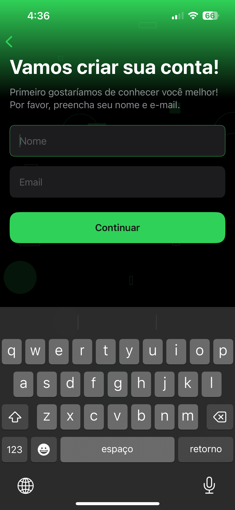

<p align="center">
  
</p>

<p align="center">
  <strong>CheckListy</strong> is more than just a to-do list app — it's a smart task manager powered by voice commands, real-time syncing, and modern navigation built with SwiftUI.
</p>

<p align="center">
  
  
  
  
  
  
  
  
</p>


<p align="center">
  
</p>

## ✨ Features

- ✅ Add and edit tasks quickly with a clean interface.
- 🗣️ Mark tasks as done or undone using **voice commands**:
  - `"Task Name OK"` → checks the item.
  - `"Task Name No"` or `"Task Name Não"` → unchecks the item.
- 🔄 Auto-sync with **Firebase Realtime Database**.
- 🔐 User authentication via **Firebase Authentication**.
- 🔐 Sign in with **Google**.
- ☁️ Store profile images using **Firebase Storage**.
- 💾 Local data persistence with **Realm** (used to cache the user's profile image).
- 🧼 Built-in section to delete all user data (local and remote).
- 🤝 Share lists with others in real-time.
- 🧭 Uses the new **type-based navigation** system (`navigationDestination`).
- 🎨 Full UI/UX design created in **Figma**.


## 🖼️ Screenshots

<p align="center">
  
  
  
  
  
</p>

<p align="center">
  
  
  
  
  
</p>

---

## ⚙️ Tech Stack

- [x] **Swift + SwiftUI**
- [x] **Firebase (Auth, Realtime Database, Storage)**
- [x] **Google Sign-In**
- [x] **Combine** with `@PropertyWrapper` for reactivity
- [x] **Speech Framework** (Apple) for voice recognition
- [x] **RealmSwift** (only for local photo cache)
- [x] **Offline Persistence + Auto-Sync**
- [x] Modern navigation with `navigationDestination`


## 🧪 Voice Command Examples

Just speak:

- `"Buy milk OK"` → checks the item  
- `"Buy milk No"` or `"Buy milk Não"` → unchecks the item

> Perfect for **hands-free productivity** anywhere.


## 📲 Installation (Private Dev Build)

1. Clone the repository:

```bash
git clone https://github.com/your-username/checklisty.git
cd checklisty
```

> ⚠️ ***This project is under active development:*** Features and UI may change rapidly while improvements are being made.